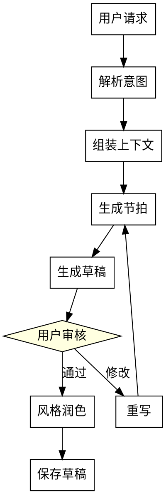

# 小说创作编排

编排 **Director → Writer → User Review → Stylist** 完整创作流程。

## 触发条件

- "写第X章" / "写章节"
- "生成章节" / "生成草稿"
- "续写" / "继续创作"
- "创作" + 章节相关

## 工作流程



## Step 1: 解析意图

从用户请求中提取：
- **章节 ID**: `ch_005` 或 `第五章`
- **创作目标**: 继续故事、特定场景、情感走向
- **约束条件**: 禁用词、必需元素、字数要求

## Step 2: 组装上下文

调用 `ContextBuilder.build_generation_context()`：

```
上下文组件:
├── 大纲窗口（前后 5 章）
│   └── 确保剧情连贯
├── 出场角色档案
│   └── 自动识别 involved_characters
├── 伏笔状态
│   ├── 待回收: 需要在本章或后续回收
│   └── 已埋下: 可以呼应
├── 三层风格
│   ├── craft/ 通用技法（dialogue_craft + scene_craft + rhythm_craft + humanization）
│   ├── data/reference_styles/{参考作品}/ 风格指纹
│   └── data/novels/{id}/characters/ + world/ 设定约束
├── 世界观规则
│   └── 相关实体和关系
└── 真相文件（融合 InkOS）
    ├── current_state.md - 世界当前状态
    ├── pending_hooks.md - 待回收伏笔
    ├── particle_ledger.md - 资源账本
    └── chapter_summaries.md - 章节摘要
```

**可选：使用内置 Agent**

如果需要更强大的写作能力，可使用内置 Agent：

```python
from tools.agent import WriterAgent, AgentContext
from tools.llm import LLMClient, LLMConfig

config = LLMConfig.from_env()
client = LLMClient(config)
ctx = AgentContext(client, config.model, project_root)

writer = WriterAgent(ctx)
result = await writer.write_chapter(context, chapter_number=5)
```

WriterAgent 采用**两阶段写作**：
1. **创意写作** (temperature=0.7) - 生成章节正文
2. **状态结算** (temperature=0.3) - 将变化合并到真相文件

## Step 3: 确定戏剧位置

**章节不独立做起承转合。** 起承转合在「节」层面完成：

```
节（5章）= 起(ch01) → 承(ch02-03) → 转(ch04) → 合(ch05)
```

从大纲获取当前章节的 **dramatic_position**（起/承/转/合/过渡），
以及所属节的 **section_structure** 和 **section_emotional_arc**。

示例：
```
篇弧线: 铺垫(sec01-02) → 发展(sec03-05) → 高潮(sec06) → 收束(sec07)
节结构: 起(ch21) → 承(ch22-23) → 转(ch24) → 合(ch25)
节情感: 好奇 → 震惊 → 愤怒 → 释然
▶ 本章位于: 转
▶ 本章焦点: 主角发现真相，内心崩溃
```

## Step 4: 生成节拍

节拍是**章内微结构**，按 dramatic_position 从 `templates/beat_templates.yaml` 选择：

- **起** → 场景切入 + 悬念铺设 + 角色状态 + 衔接钩子
- **承** → 推进 + 碰撞 + (伏笔) + 递进
- **转** → 升级 + 核心决策 + 后果初现
- **合** → 余波 + 变化确认 + 遗留

节拍数量由章节字数决定（3000字以下: 2-3个; 3000-5000: 3-4个; 5000+: 4-6个），
不由戏剧结构决定。

## Step 5: 生成草稿

将节拍扩写为散文，关键约束：
- 本章的情绪基调必须与 section_emotional_arc 中对应位置一致
- 节奏/张力须与 dramatic_position 匹配（「转」要比「承」更快更紧张）
- 应用风格档案
- 确保角色声音一致

## Step 6: 用户审核（强制）

**必须暂停等待用户确认！**

```
📝 草稿已生成

**章节**: {chapter_id}
**戏剧位置**: {dramatic_position}
**字数**: {word_count}
**节拍数**: {beat_count}

### 预览（前 500 字）
{preview_text}

---

**请审核后选择**：
1. ✅ 通过 - 进入风格润色
2. 🔄 重写 - 提供修改意见  
3. 📋 手动编辑 - 保存草稿，退出流程
```

### 用户选择处理

| 选择 | 操作 |
|------|------|
| **通过** | 进入 Step 7 风格润色 |
| **重写** | 收集用户反馈 → 返回 Step 4 重新生成节拍 |
| **手动编辑** | 保存草稿到 `manuscript/` → 结束流程 |

## Step 7: 风格润色（可选）

使用 style-system Skill：
- AI 痕迹检测（40+ 中文 AI 套路词）
- 声音一致性检查
- 节奏分布验证（须匹配 dramatic_position 要求的张力）
- 信息倾倒检测

## Step 8: 保存草稿

保存到 `data/novels/{novel_id}/manuscript/`：

```
manuscript/
├── arc_001/
│   ├── ch_005.md          # 最终版本
│   ├── ch_005_draft.md    # 初稿
│   └── ch_005_review.yaml # 审查记录
```

## 文件访问

| 操作 | 路径 |
|------|------|
| 读取大纲 | `data/novels/{novel_id}/outline/` |
| 读取角色 | `data/novels/{novel_id}/characters/` |
| 读取风格 | `data/reference_styles/{参考作品}/` + `data/novels/{novel_id}/style/composed.md` |
| 读取世界观 | `data/novels/{novel_id}/world/` |
| 写入草稿 | `data/novels/{novel_id}/manuscript/` |

## 前置条件

开始写章节前，确保以下数据已就绪：

| 数据 | 必须？ | 说明 |
|------|--------|------|
| 大纲 (outline/) | ✅ 必须 | 至少有当前章节的章纲 |
| 角色卡 (characters/cards/) | ✅ 必须 | 本章出场角色的卡片 |
| 合成风格 (style/composed.md) | ⚠️ 建议 | 没有则使用默认风格 |
| 世界观 (world/) | 可选 | 有则加载作为约束 |
| 伏笔 (foreshadowing/) | 可选 | 有则提示待回收伏笔 |

## 错误处理

| 错误 | 处理 |
|------|------|
| 上下文超限 | 自动压缩低优先级内容 |
| 角色档案缺失 | 使用简卡信息 |
| 生成失败 | 重试 3 次，然后报错 |
| 用户中断 | 保存当前草稿 |

## 与其他 Skill 的关系

- **novel-manager**: 查询/修改大纲、角色、世界观
- **novel-reviewer**: 审查已完成的章节

## 示例对话

```
用户: 写第五章，主角发现真相

AI: 我来帮你创作第五章。

[组装上下文...]
- 大纲位置: 第五章位于第一篇的中段
- 出场角色: 李逍遥、林月如
- 待回收伏笔: 第二章埋下的神秘信件

[生成节拍...]
ch_005 开场: 李逍遥在书房发现一封神秘信件
ch_005 发展1: 信件揭示了一个惊人的真相...
...

[生成草稿...]

📝 草稿已生成（3521字）

### 预览
书房的烛火摇曳，李逍遥的手指颤抖着拆开那封泛黄的信件...

请选择：
1. ✅ 通过
2. 🔄 重写
3. 📋 手动编辑

用户: 1

AI: [风格润色中...]

✅ 第五章已完成，保存到 manuscript/arc_001/ch_005.md
```
