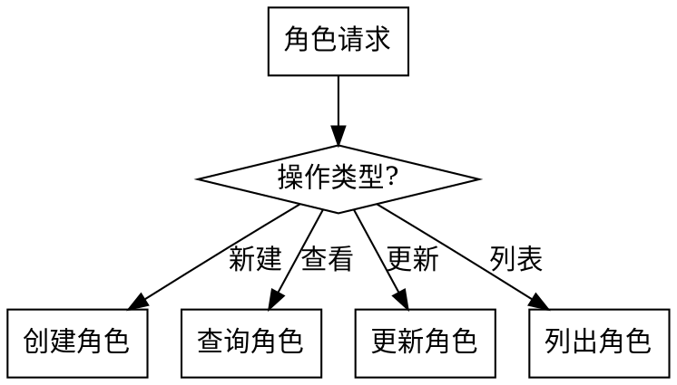

# 小说项目管理

管理角色、世界观、伏笔、大纲等项目数据。

## 触发条件

- **角色**: "新建角色"、"查看角色"、"更新角色"
- **世界观**: "世界观"、"创建实体"、"关系"
- **大纲**: "查看大纲"、"修改大纲"、"大纲结构"
- **伏笔**: "伏笔状态"、"待回收伏笔"、"埋伏笔"
- **项目**: "项目信息"、"初始化项目"

## 子功能

### 1. 角色管理



#### 创建角色

```
用户: 新建角色 张三 主角

AI: 我来创建角色 "张三"。

请提供以下信息：
1. 简要描述：张三是什么样的人？
2. 外貌特征（可选）
3. 性格特点（可选）

用户: 张三是个落魄书生，性格正直但有些迂腐

AI: ✅ 角色已创建

**角色卡**: `characters/cards/zhang_san.yaml`
**档案**: `characters/profiles/zhang_san.md`

| 字段 | 值 |
|------|-----|
| ID | zhang_san |
| 名字 | 张三 |
| 层级 | 主角 |
| 描述 | 落魄书生，性格正直但有些迂腐 |
| 首次出场 | 未设置 |
```

#### 查询角色

```
用户: 查看张三的档案

AI: 📋 角色档案：张三

**基本信息**
- 层级: 主角
- 年龄: 25
- 身份: 落魄书生

**外貌**
面容清瘦，常穿一件洗得发白的青衫...

**性格**
- 正直
- 迂腐
- 固执

**关系**
- 李四: 好友
- 王五: 敌对

**时间线事件**
1. ch_001: 初次登场
2. ch_003: 与李四结识
```

### 2. 世界观管理

#### 实体操作

```
用户: 创建地点 琅琊阁

AI: 我来创建地点 "琅琊阁"。

请描述这个地点：
- 它是什么地方？
- 有什么特点？
- 有什么规则？

用户: 琅琊阁是天下的情报中心，只有持有令牌才能进入

AI: ✅ 实体已创建

**实体**: `world/entities/langya_ge.md`

| 字段 | 值 |
|------|-----|
| ID | langya_ge |
| 类型 | location |
| 名称 | 琅琊阁 |
| 描述 | 天下情报中心 |
| 规则 | 需令牌进入 |
```

#### 关系查询

```
用户: 张三和哪些人有关系？

AI: 🔗 关系网络：张三

```
张三 (protagonist)
├── 李四 (friend) - 好友
├── 王五 (enemy) - 敌对
└── 琅琊阁 (member) - 成员
```
```

### 3. 大纲管理

#### 查看大纲

```
用户: 查看第五章的大纲

AI: 📖 第五章大纲

**路径**: arc_001 > section_002 > ch_005

| 字段 | 值 |
|------|-----|
| 标题 | 真相大白 |
| 摘要 | 主角发现信件，揭开阴谋 |
| 目标字数 | 5000 |
| 出场角色 | 张三、李四 |
| 伏笔引用 | ch_002_mystery_letter |
| 状态 | outlined |

**创作目标**:
- 揭示第二章埋下的伏笔
- 推动主线剧情发展
- 制造新的悬念
```

#### 修改大纲

```
用户: 把第五章的标题改成"惊天内幕"

AI: ✅ 大纲已更新

**修改内容**:
- 标题: "真相大白" → "惊天内幕"

**影响范围**:
- hierarchy.yaml
- outline.md (同步更新)

是否需要同步修改其他内容？
```

### 4. 伏笔管理

#### 查看伏笔状态

```
用户: 有哪些伏笔待回收？

AI: 🎯 待回收伏笔 (3个)

| ID | 描述 | 埋下章节 | 计划回收 |
|----|------|---------|---------|
| ch_002_mystery_letter | 神秘信件 | ch_002 | ch_005 |
| ch_003_hidden_skill | 隐藏武功 | ch_003 | ch_008 |
| ch_001_prophecy | 预言诗 | ch_001 | arc_002 |

⚠️ 注意：ch_002_mystery_letter 计划在本章回收
```

#### 伏笔 DAG 检查

```
用户: 检查伏笔有没有循环依赖

AI: 🔍 伏笔 DAG 检查

✅ 无循环依赖
✅ 无孤立节点
⚠️ 发现 1 个超期未回收的伏笔:
- ch_001_hint (已超期 3 章)
```

### 5. 项目信息

```
用户: 项目信息

AI: 📊 项目概览

**基本信息**
- 小说 ID: my_novel
- 标题: 《江湖风云录》
- 作者: 张三
- 目标字数: 500,000

**进度统计**
- 已完成章节: 12
- 总字数: 58,000
- 角色数: 15
- 伏笔数: 8 (待回收: 3)

**目录结构**
```
data/novels/my_novel/
├── outline/
│   ├── hierarchy.yaml
│   └── outline.md
├── characters/
│   ├── cards/ (15)
│   └── profiles/ (15)
├── world/
│   ├── rules.md          # 世界底层规则
│   ├── timeline.md       # 关键事件时间线
│   ├── terminology.md    # 术语表
│   └── entities/         # 实体（*.md）
├── foreshadowing/
│   └── dag.yaml
└── manuscript/
    └── arc_001/ (12 chapters)
```
```

## 文件访问

| 操作 | 路径 |
|------|------|
| 角色卡 | `data/novels/{id}/characters/cards/*.yaml` |
| 角色档 | `data/novels/{id}/characters/profiles/*.md` |
| 世界规则 | `data/novels/{id}/world/rules.md` |
| 时间线 | `data/novels/{id}/world/timeline.md` |
| 术语表 | `data/novels/{id}/world/terminology.md` |
| 世界实体 | `data/novels/{id}/world/entities/*.md` |
| 世界图谱 | `python3 tools/world_query.py {id} --relations` （自动生成） |

## 数据格式定义

### 角色卡片字段
```yaml
id: zhang_san                    # 唯一标识（拼音或英文）
name: 张三                        # 角色名称
tier: protagonist                # 层级
age: 18                          # 年龄（可选）
identity: 书生                    # 身份/职业
description: 简要描述
first_appearance: ch_001         # 首次出场章节
status: active                   # 状态
```

### 枚举值定义

**tier (角色层级)**:
- `protagonist`: 主角
- `antagonist`: 反派
- `supporting`: 配角
- `background`: 背景角色

**type (实体类型)**:
- `location`: 地点
- `item`: 物品
- `organization`: 组织
- `event`: 事件
- `concept`: 概念

**status (状态)**:
- `active`: 活跃
- `archived`: 归档
- `deceased`: 已故（角色）
- `destroyed`: 摧毁（实体）
- `hidden`: 隐藏
- `sealed`: 封印

### ID 生成规则

将中文名转换为ID时使用拼音:
- 张三 → zhang_san
- 琅琊阁 → langya_ge

推荐使用 `pypinyin` 库:
```python
from pypinyin import lazy_pinyin
id_str = "_".join(lazy_pinyin(name)).lower()
```

### 模板文件

模板文件位于 `skills/novel-manager/templates/`:
- `character_card.yaml` - 角色卡片模板
- `character_profile.md` - 角色档案模板
- `world_entity.md` - 世界观实体模板（Markdown 格式）
## 错误处理

| 错误 | 处理 |
|------|------|
| 角色不存在 | 提示创建新角色 |
| 循环依赖 | 拒绝操作，显示依赖链 |
| 数据格式错误 | 尝试修复或提示手动修复 |

## 与其他 Skill 的关系

- **novel-creator**: 创作时查询大纲、角色、伏笔
- **novel-reviewer**: 审查后更新伏笔状态
