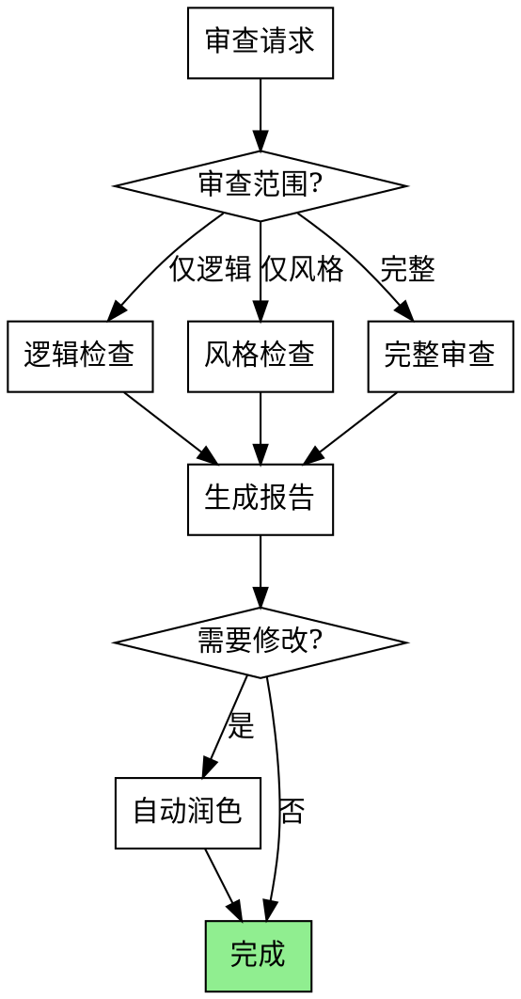

# 小说审查润色

编排 **LoreChecker + Stylist + StyleDirector** 审查流程。

## 触发条件

- "检查逻辑" / "逻辑检查"
- "润色" / "润色风格"
- "找伏笔漏洞" / "伏笔检查"
- "审查章节" / "审查"
- "风格问题"

## 工作流程



## 审查类型

### 1. 逻辑检查 (LoreChecker)

```python
检查项目:
├── 时间线一致性
│   └── 事件顺序是否合理
├── 角色状态变异
│   ├── 获得物品 (acquire)
│   ├── 使用技能 (use)
│   ├── 移动位置 (move)
│   ├── 生命状态 (health)
│   └── 修炼境界 (realm)
├── 伏笔回收状态
│   ├── 待回收是否超期
│   └── 回收是否合理
└── 世界观规则
    └── 是否违反设定
```

**可选：使用内置 ReviewerAgent（融合 InkOS 33维度审计）**

```python
from tools.agent import ReviewerAgent, AgentContext
from tools.llm import LLMClient, LLMConfig

config = LLMConfig.from_env()
client = LLMClient(config)
ctx = AgentContext(client, config.model, project_root)

reviewer = ReviewerAgent(ctx)
result = await reviewer.review(content, context, dimensions=[1,2,3,6,7,8])
```

ReviewerAgent 支持 **33维度审计**（从 InkOS 融合）：

| 维度 | 名称 | 维度 | 名称 |
|------|------|------|------|
| 1-9 | 逻辑类 | 20-23 | AI痕迹类 |
| 10-19 | 质量类 | 24-37 | 高级审计类 |

#### 逻辑检查示例

```
用户: 检查第五章的逻辑

AI: 🔍 逻辑检查：第五章

## 检查结果

### ✅ 通过项
- 时间线顺序正确
- 角色位置连续
- 伏笔引用有效

### ⚠️ 警告 (2)
1. **角色状态**: 张三在 ch_004 受伤，但 ch_005 直接战斗未说明恢复
   - 建议: 添加伤势恢复的描述

2. **世界观**: 琅琊阁需要令牌才能进入，但张三直接进入
   - 建议: 说明令牌来源或进入方式

### ❌ 错误 (0)
无严重逻辑错误
```

### 2. 风格检查 (Stylist)

```python
检查项目:
├── AI 痕迹检测
│   ├── 40+ 中文 AI 套路词 (craft/ai_patterns.yaml)
│   ├── 段落等长变异系数检测 (融合 InkOS dim 20)
│   ├── 套话词密度检测 (融合 InkOS dim 21)
│   ├── 公式化转折词检测 (融合 InkOS dim 22)
│   └── 列表式结构检测 (融合 InkOS dim 23)
├── 声音一致性
│   └── 叙述者与角色声音融合
├── 信息倾倒
│   └── 过度密集的信息描述
├── 节奏分布
│   └── 段落长度变化
└── 对话风格
    └── 符合角色性格
```

#### AI 痕迹检测词库（部分，完整见 craft/ai_patterns.yaml）

```
禁用词:
- "仿佛" + 比喻
- "如同" + 比喻
- "心中涌起一股..."
- "眼神中闪过一丝..."
- "嘴角微微上扬"
- "轻轻地点了点头"
- "缓缓地吐出一口气"
- "不禁..."
- "不由得..."
- "下意识地..."
```

#### 风格检查示例

```
用户: 检查第五章的风格

AI: 🎨 风格检查：第五章

## 检查结果

### ❌ AI 痕迹 (3处)
1. 第12行: "嘴角微微上扬"
   - 替换建议: "笑了" 或 具体表情描写

2. 第45行: "心中涌起一股莫名的情绪"
   - 替换建议: 描述具体情绪或身体反应

3. 第78行: "眼神中闪过一丝复杂的神色"
   - 替换建议: 具体描述是什么神色

### ⚠️ 节奏问题 (1处)
- 第3-5段连续长段落（>200字）
- 建议: 插入短句或对话调节节奏

### ✅ 通过项
- 声音一致性良好
- 对话符合角色性格
- 无信息倾倒

## 风格评分
| 维度 | 分数 |
|------|------|
| AI 痕迹 | 75/100 |
| 声音一致性 | 90/100 |
| 节奏分布 | 85/100 |
| 综合评分 | 83/100 |
```

### 3. 完整审查报告

```
用户: 审查第五章

AI: 📋 完整审查报告：第五章

## 基本信息
- 章节: ch_005
- 字数: 3,521
- 审查时间: 2026-03-03 08:50

## 一、逻辑检查

| 类别 | 状态 | 数量 |
|------|------|------|
| 错误 | ❌ | 0 |
| 警告 | ⚠️ | 2 |
| 通过 | ✅ | 8 |

### 警告详情
1. [角色状态] 张三伤势未说明恢复
2. [世界观] 琅琊阁进入方式未说明

## 二、风格检查

| 维度 | 分数 | 状态 |
|------|------|------|
| AI 痕迹 | 75 | ⚠️ 需改进 |
| 声音一致性 | 90 | ✅ 良好 |
| 节奏分布 | 85 | ✅ 良好 |

### 需修改项
1. 第12行: "嘴角微微上扬" → 建议修改
2. 第45行: "心中涌起..." → 建议修改
3. 第78行: "眼神中闪过..." → 建议修改

## 三、伏笔检查

| 伏笔 ID | 状态 | 说明 |
|---------|------|------|
| ch_002_mystery_letter | ✅ 已回收 | 信件内容揭示 |

## 总结

**审查结果**: 需修改后通过

**建议操作**:
1. 修复 2 处逻辑警告
2. 修改 3 处 AI 痕迹
3. 调整 1 处节奏问题

**下一步**:
- 输入 "润色" 自动修复风格问题
- 或手动修改后重新审查
```

## 自动润色（基于已合成风格）

```

**说明**: 风格规则直接从 `composed.md` 读取，该文件已包含三层合成结果（craft/ + styles/ + novels/），无需重新组装。
用户: 润色第五章

AI: ✨ 风格润色中...

### 修改内容

**第12行**:
- 原文: 他嘴角微微上扬。
- 修改: 他笑了，眼角的皱纹舒展开来。

**第45行**:
- 原文: 他心中涌起一股莫名的情绪。
- 修改: 他握紧了拳头，指甲陷入掌心。

**第78行**:
- 原文: 她眼神中闪过一丝复杂的神色。
- 修改: 她垂下眼帘，睫毛在烛光中投下阴影。

### 润色统计
- 修改处: 3
- 新增字数: +15
- 删除字数: -12

✅ 润色完成，已更新 manuscript/arc_001/ch_005.md
```

## 文件访问

| 操作 | 路径 |
|------|------|
| 读取草稿 | `data/novels/{id}/data/manuscript/` |
| 读取合成风格 | `data/novels/{id}/data/style/composed.md` |
| 读取参考风格 | `data/reference_styles/{参考作品}/` |
| 读取角色设定 | `data/novels/{id}/src/characters/` + `data/novels/{id}/data/characters/cards/` |
| 读取世界观 | `data/novels/{id}/src/world/` + `data/novels/{id}/data/world/` |
| 写入润色 | `data/novels/{id}/data/manuscript/` |
| 审查记录 | `data/novels/{id}/data/manuscript/*_review.yaml` |

## 审查模式

| 模式 | 严格度 | 说明 |
|------|--------|------|
| 宽松 | 低 | 仅报告错误，警告不阻塞 |
| 标准 | 中 | 报告错误和警告 |
| 严格 | 高 | 警告也阻塞通过 |

## 错误处理

| 错误 | 处理 |
|------|------|
| 文件不存在 | 提示先创建草稿 |
| 风格档案缺失 | 使用默认规则 |
| 润色失败 | 保留原文，报告失败原因 |

## 与其他 Skill 的关系

- **novel-creator**: 创作完成后触发审查
- **novel-manager**: 审查后更新伏笔状态
